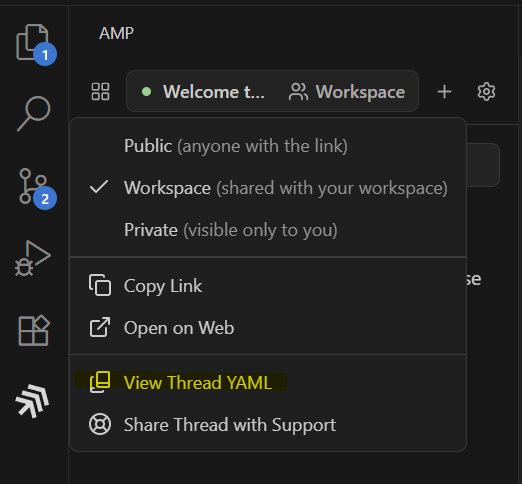

# 如何获取 [Amp](https://ampcode.com) 的系统提示

1. 使用 VScode 登录 Amp
2. 向 Amp 发送一个简短查询
3. 按住 Alt (Windows) 或 Option (macOS) 键并点击工作区按钮



4. 点击查看 Thread YAML

# 注意事项

Amp 使用的系统提示是针对 Sonnet 4.x 进行调优的，并且将其他大语言模型作为工具（"the oracle"）注册其中。要获取 `GPT-5` 调优的系统提示，您需要在 VSCode 用户设置中进行如下配置，然后再次按照上述步骤操作

```json
{
    "amp.url": "https://ampcode.com/",
    "amp.gpt5": true
}
```